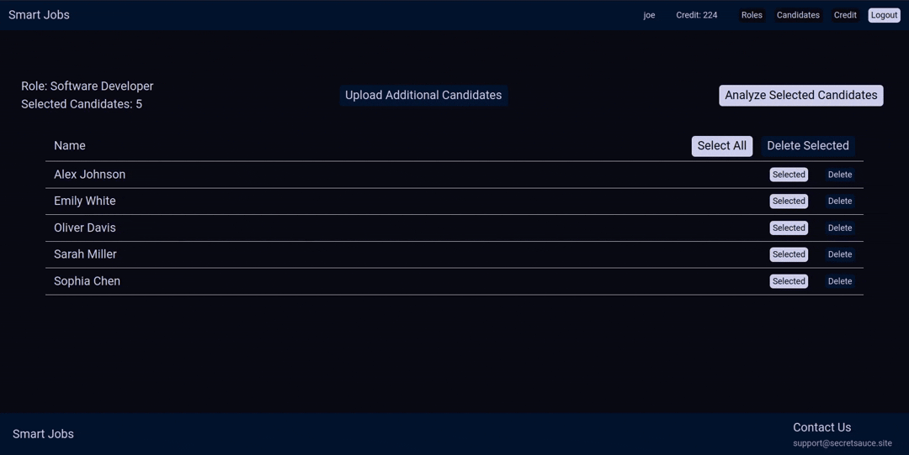

# SmartJobs

## SmartJobs: Intelligent Career Matching and Analysis

SmartJobs is a sophisticated web application designed to revolutionize the job search and recruitment process. It leverages advanced AI to provide intelligent matching between candidates and roles, deep CV analysis, and comprehensive insights into career trajectories and criteria.



---

## Features

* **AI-Powered Role Matching:** Automatically match candidate profiles against job roles based on predefined criteria.
* **Detailed CV Analysis:** Analyze CVs to extract relevant skills, experience, and qualifications.
* **Customizable Criteria:** Define and manage specific criteria for roles and candidates.
* **Credit System:** A built-in credit system for managing usage of premium features (e.g., AI analyses).
* **User Management:** Secure user authentication and authorization.
* **Dynamic UI:** Built with **HTMX** and **Thymeleaf** for a responsive user experience.

---

## Design

This section outlines the key architectural decisions and patterns employed in SmartJobs.

### Hexagonal Architecture (Ports and Adapters)

SmartJobs is built upon a Hexagonal Architecture, also known as the Ports and Adapters pattern. This architectural style promotes a clear separation of concerns, making the application more modular, testable, and maintainable.

*   **`core` (Domain Logic):** This is the heart of the application, containing the business logic, entities, and use cases. It is completely independent of any specific technology or framework. The `core` defines "ports" (interfaces) that dictate how it interacts with the outside world.
*   **`adaptors` (Infrastructure and UI):** These are the external components that interact with the `core` through the defined ports. Adapters are responsible for concerns like:
    *   **UI (Web Interface):** Handling HTTP requests, rendering web pages (using Spring MVC, Thymeleaf, HTMX).
    *   **Database Persistence:** Implementing data storage and retrieval (using Spring Data JPA, PostgreSQL).
    *   **External Services:** Integrating with third-party APIs or services.
    *   **Messaging:** Handling asynchronous communication if applicable.

This separation ensures that the `core` domain logic remains pure and can be easily tested in isolation. Changes in technology (e.g., switching database providers or UI frameworks) primarily affect the `adaptors` layer, minimizing impact on the core business rules.

### High Concurrency Model

SmartJobs is designed to handle a high volume of concurrent users and requests efficiently.

*   **Java 21 Virtual Threads:** The application leverages Java 21's virtual threads (Project Loom) to manage concurrent operations. Virtual threads are lightweight and allow for a significantly higher number of concurrent tasks compared to traditional platform threads, reducing resource overhead and improving scalability.
*   **`ConcurrencyUtil` Class:** A dedicated utility class, `org.smartjobs.shared.ConcurrencyUtil`, provides helper methods and configurations for managing concurrency, ensuring optimal use of virtual threads and other concurrency primitives. This might include custom thread pools or executors tailored for specific tasks.

### Other Key Architectural Aspects

*   **Technology Stack:**
    *   **Spring Boot 3.5.0:** Provides a robust and convention-over-configuration framework for building the application.
    *   **Java 21:** The primary programming language, offering modern features like virtual threads.
    *   **PostgreSQL:** Used as the relational database for persistent storage.
    *   **Spring Data JPA & Hibernate:** For Object-Relational Mapping (ORM) and simplified data access.
    *   **Spring Security:** For handling authentication and authorization.
    *   **HTMX & Thymeleaf:** For creating dynamic and interactive user interfaces with server-side rendering.
*   **Project Setup:**
    *   **Maven:** Used for dependency management and building the project.
    *   **Docker (via Testcontainers):** Employed for creating isolated and reproducible environments for integration testing, particularly for the PostgreSQL database.
    *   **GitHub Actions:** Utilized for continuous integration and continuous deployment (CI/CD) pipelines, automating builds, tests, and deployments.
*   **Modularity:** The project is structured into modules (e.g., `core`, `adaptors`, `app`) to enforce separation of concerns and improve maintainability.
*   **Resilience:** Patterns like rate limiting (Bucket4j) and caching (Caffeine) are used to enhance application stability and performance under load.

---

## Getting Started

These instructions will help you set up and run a trial version of SmartJobs on your local machine using a self-contained database.

### Prerequisites

Before you begin, ensure you have the following installed:

* **Java Development Kit (JDK) 21**: Make sure `JAVA_HOME` is set correctly.
* **Maven 3.8.x** (or newer):
* **Docker Desktop (or Docker Engine)**: Required for Testcontainers to run the PostgreSQL database. **Ensure Docker is running** before proceeding.

### Installation

1. **Clone the repository:**
   ```bash
   git clone git@github.com:Magic-JD/SmartJobs.git
   cd smart-jobs
   ```
2. **Build the project:**
   ```bash
   mvn clean install
   ```
   This command compiles the code, runs unit tests, and packages the application.

---

## Trialing the Application (Testcontainers Environment)

To experience SmartJobs, you can run a local instance that uses a PostgreSQL database spun up automatically by Testcontainers. This setup ensures a clean and isolated environment for your trial, without connecting to any external backend services.

To start the application in trial mode:

```bash
mvn spring-boot:test-run
```

This command will:

* Start a new **PostgreSQL container** in Docker.
* Initialize the database schema (`schema.sql`) and populate it with sample data (`data.sql`).
* Launch the SmartJobs application, connecting it to this temporary PostgreSQL database.

The application will be available on **HTTP port 8080** (e.g., `http://localhost:8080`).

You can log in with the following trial credentials:

* **Username:** `email@email.com`
* **Password:** `password1`

---

## Running Tests

SmartJobs includes a comprehensive suite of unit and integration tests.

To run just the unit tests run:

```bash
mvn test
```

### Running All Tests

To run all tests (unit and integration), execute:

```bash
mvn verify
```

### Running Integration Tests Specifically

Integration tests leverage Testcontainers to provide a fresh, isolated PostgreSQL database for each test run. They use the `test` profile to ensure consistent environments and initialize data **before** each test method for reliable execution.
